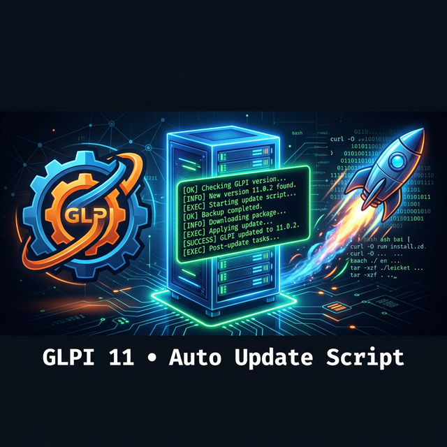
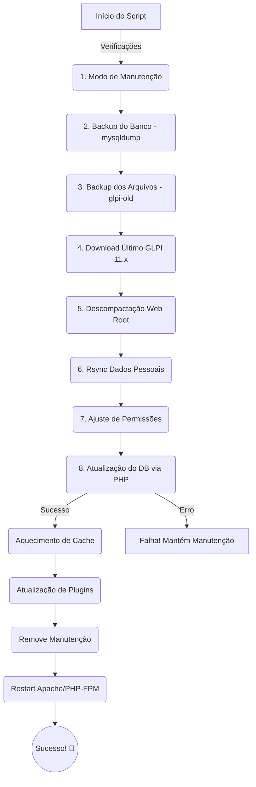

<div align="center">



# 🚀 GLPI 11 — Enterprise Auto Update Script

[](LICENSE)
[](glpi-update.sh)
[](https://almalinux.org)
[](https://glpi-project.org)
[](https://github.com/glpi-project/glpi/releases)

> **The ultimate smart bash script that detects, downloads, and safely applies the latest stable GLPI 11.x version — featuring automatic database backups, secure permissions, and robust error handling.**

[ 🇧🇷 Ler em Português ](#-português-br) &nbsp;&nbsp;|&nbsp;&nbsp; [ 🇺🇸 Read in English ](#-english-us)

---

</div>

## 🇧🇷 Português (BR)

O script definitivo para manter o seu GLPI 11 atualizado sem dor de cabeça, focado em segurança de ambiente Enterprise.

### ✨ Funcionalidades

| Ícone | Recurso | Detalhe |
|:---:|-----------|---------|
| 📝 | **Logs de Execução** | Salva o histórico completo da atualização em `/var/log/glpi-update-*.log`. |
| 🔒 | **Modo de Manutenção** | Ativa automaticamente antes do backup, garantindo a integridade dos dados. |
| 🗄️ | **Backup do Banco (Novo)** | Extrai credenciais do `config_db.php` e gera um `.sql` em `/root/` de forma autônoma. |
| 📦 | **Backup de Arquivos** | Renomeia `glpi/` para `glpi-old/` isolando a versão antiga. |
| 🌐 | **Smart Download** | Consulta a API do GitHub para a última versão **11.x estável**. |
| 📁 | **Restauração Inteligente** | Utiliza `rsync` (com barra de progresso) para voltar `files/`, `config/`, `plugins/` e `marketplace/`. |
| 🔐 | **Permissões Nativas** | Segue a documentação oficial (código em root, arquivos em apache). |
| 🛡️ | **Fail-Safe db:update** | Aborta a atualização se o banco falhar, evitando corromper a aplicação. |
| 🧩 | **Gestão de Plugins** | Tenta verificar e reativar plugins automaticamente pós-atualização. |
| 🔄 | **Flush de OPcache** | Reinicia `httpd` e `php-fpm` para evitar "telas em branco" ao finalizar. |

---

### 📋 Pré-requisitos

**Sistema:** AlmaLinux 10.1 (ou base RHEL/CentOS) com GLPI 10 ou 11 instalado.

```bash
# Instale as dependências essenciais
sudo dnf install jq rsync curl tar mariadb-server -y
```

*(O `mysqldump` é obrigatório para o backup autônomo do banco de dados).*

---

### 🚀 Como usar

#### 1. Baixe o script
```bash
curl -O https://raw.githubusercontent.com/celsocaninde/script-update-glpi11/main/glpi-update.sh
```

#### 2. Execute como root
```bash
sudo bash glpi-update.sh
```
Pronto. Assista ao progresso na tela e tome um café ☕.

---

### 🔄 Fluxo de Execução (O que acontece por baixo dos panos?)



---

<br><br>

## 🇺🇸 English (US)

The ultimate script to keep your GLPI 11 up to date painlessly, with a strong focus on Enterprise environment security.

### ✨ Features

| Icon | Feature | Detail |
|:---:|-----------|---------|
| 📝 | **Execution Logs** | Saves the complete update history in `/var/log/glpi-update-*.log`. |
| 🔒 | **Maintenance Mode** | Activates automatically before backup, ensuring zero data inconsistency. |
| 🗄️ | **Auto DB Backup (New)** | Extracts credentials from `config_db.php` and dumps a `.sql` in `/root/`. |
| 📦 | **File Backup** | Renames `glpi/` to `glpi-old/` isolating the old version. |
| 🌐 | **Smart Download** | Queries GitHub API for the latest **11.x stable** release. |
| 📁 | **Smart Restore** | Uses `rsync` (with progress bar) to inject `files/`, `config/`, `plugins/` back. |
| 🔐 | **Native Permissions** | Follows official docs (source code as root, files as apache). |
| 🛡️ | **Fail-Safe db:update** | Aborts update if the database migration fails, preventing app corruption. |
| 🧩 | **Plugin Management** | Attempts to verify and reactivate plugins automatically after updating. |
| 🔄 | **OPcache Flush** | Restarts `httpd` and `php-fpm` to prevent "blank screens" upon finishing. |

---

### 📋 Prerequisites

**System:** AlmaLinux 10.1 (or RHEL/CentOS base) running GLPI 10 or 11.

```bash
# Install essential dependencies
sudo dnf install jq rsync curl tar mariadb-server -y
```

*(Note: `mysqldump` is mandatory for the autonomous database backup).*

---

### 🚀 How to use

#### 1. Download the script
```bash
curl -O https://raw.githubusercontent.com/celsocaninde/script-update-glpi11/main/glpi-update.sh
```

#### 2. Run as root
```bash
sudo bash glpi-update.sh
```
That's it. Watch the progress bar and grab a coffee ☕.

---

### 🛡️ Security & Recovery / Segurança e Recuperação

If something goes terribly wrong, here is how you can revert manually. 

**Database:**
```bash
mysql -u root -p glpi_db < /root/glpi-db-backup-202X...sql
```

**Files:**
```bash
sudo mv /var/www/html/glpi      /var/www/html/glpi-failed
sudo mv /var/www/html/glpi-old  /var/www/html/glpi
```

**Clean up (when successful):**
```bash
sudo rm -rf /var/www/html/glpi-old
```

---

<div align="center">

**Feito com ❤️ para a comunidade GLPI** / **Made with ❤️ for the GLPI Community**

</div>
